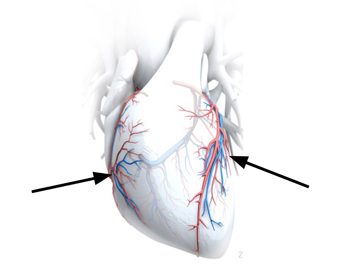
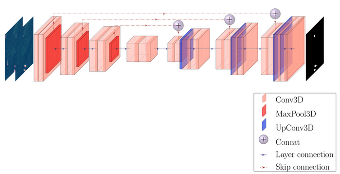
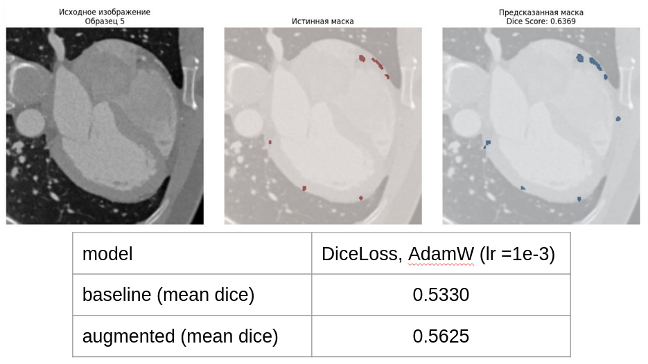
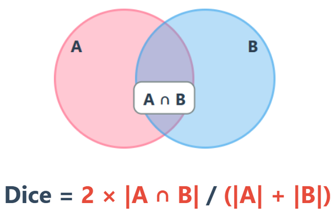
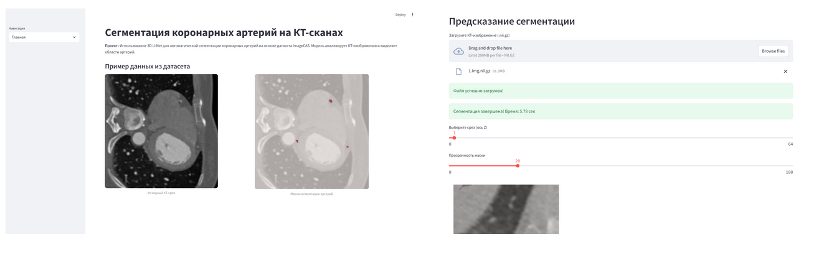

# Сегментация коронарных артерий на КТ-изображениях датасета ImageCAS

## Обзор

Проект посвящен сегментации коронарных артерий на трехмерных КТ-снимках с использованием нейросетевых моделей. Модель обучена на датасете ImageCAS и способна выделять сосуды сердца для последующего анализа, диагностики и в перспективе моделирования данных артерий в 3D.

Ссылка на ноутбук с полным кодом обучения (запуск as-is): [Kaggle Notebook](https://www.kaggle.com/code/dmitrygilemkhanov/segmentation-advanced)




## Датасет ImageCAS

ImageCAS представляет собой специализированный набор данных для сегментации коронарных артерий. Датасет содержит 1000 КТ-сканов с размеченными масками сосудов (для ускорения обучения было взято только 600 снимков).

Данные были разделены в соотношении 80/20 для обучающей и валидационной выборок. Каждый образец содержит пару файлов: `.img.nii.gz` (исходное КТ-изображение) и `.label.nii.gz` (маска сегментации).

## Архитектура модели

Для решения задачи применяется архитектура UNet с трехмерными сверточными слоями.



Модель состоит из энкодера, который последовательно уменьшает пространственные размеры при увеличении количества каналов, и декодера, восстанавливающего исходное разрешение через транспонированные свертки. Skip-connections между соответствующими уровнями энкодера и декодера позволяют сохранять детали изображения.

Параметры модели:

- Входные каналы: 1 (grayscale CT)
- Выходные каналы: 2 (фон + коронарная артерия)
- Количество фильтров: (32, 64, 128, 256, 512, 32)
- Dropout: 0.1
- Размер патча (ROI): 96x96x96

## Предобработка данных

Перед обучением модели данные проходят следующие этапы обработки:

### 1. Загрузка медицинских изображений
КТ-снимки загружаются из формата NIfTI (файлы `.nii.gz`). При загрузке добавляется канальное измерение, чтобы получить формат `(1, высота, ширина, глубина)` — единица означает один канал (черно-белое изображение).

### 2. Дополнение до минимального размера
Если изображение меньше 96×96×96 вокселей по любой из осей, оно дополняется нулями (черными пикселями) до этого размера.

### 3. Нормализация яркости
Значения яркости пикселей приводятся к стандартному виду: среднее значение = 0, стандартное отклонение = 1. При расчете учитываются только ненулевые вокселы (нулевые игнорируются, так как это обычно пустое пространство вокруг тела).

### 4. Приведение к единому разрешению
Все КТ-снимки приводятся к одинаковому физическому разрешению 1.0×1.0×1.0 мм через интерполяцию. Исходные снимки могут иметь разное разрешение (например, 0.5×0.5×2.0 мм у одного пациента и 0.8×0.8×1.5 мм у другого).

### 5. Вырезка кубических патчей

Из каждого полного 3D-снимка случайным образом вырезаются 4 кубика размером 96×96×96 вокселей. Это необходимо по двум причинам:

1. **Ограничение памяти GPU**: полный КТ-снимок (~512×512×300 вокселей) не помещается в видеопамять, а маленький патч (96×96×96) занимает во много раз меньше места

2. **Борьба с дисбалансом данных**: артерии занимают менее 1% объема снимка. Алгоритм `RandCropByPosNegLabeld` специально вырезает примерно 50% патчей с артериями и 50% с фоном, чтобы нейросеть училась находить артерии, а не просто предсказывала "везде фон"

Для валидационных данных используются только шаги 1-4, без вырезки патчей.

## Аугментация данных

Экспериментальная проверка показала улучшение качества модели при использовании аугментаций.



Результаты экспериментов с конфигурацией DiceLoss + AdamW (lr=1e-3):

- Baseline (без аугментаций): mean Dice = 0.5330
- Augmented (с аугментациями): mean Dice = 0.5625

Применяемые аугментации разделены на две категории:

**Геометрические трансформации** (применяются к изображению и маске):

- RandRotated: поворот до 30° по осям X/Y/Z с вероятностью 0.3
- RandFlipd: отражение по трем пространственным осям с вероятностью 0.3 для каждой
- RandZoomd: масштабирование в диапазоне 0.9-1.1x с вероятностью 0.3
- RandAffined: аффинные преобразования (поворот, масштаб, сдвиг) с вероятностью 0.3

**Фотометрические трансформации** (применяются только к изображению):

- RandAdjustContrastd: гамма-коррекция в диапазоне 0.7-1.5 с вероятностью 0.3
- RandScaleIntensityd: масштабирование интенсивности на +-10% с вероятностью 0.3
- RandGaussianNoised: добавление гауссова шума со стандартным отклонением 0.05 с вероятностью 0.3

## Функция потерь и метрика

Для обучения используется Dice Loss, которая напрямую оптимизирует коэффициент Дайса между предсказанием и истинной маской.



Dice Score вычисляется как отношение удвоенной площади пересечения к сумме площадей предсказания и истинной маски:

Значение метрики находится в диапазоне [0; 1], где 1 означает полное совпадение предсказания с истинной маской.

## Процесс обучения

Модель обучалась в течение 5 эпох с использованием оптимизатора Adam (learning rate = 1e-4) и batch size = 1 из-за больших объемов трехмерных данных.

Динамика обучения:

**Эпоха 1:**
- Train Loss: 0.5394
- Val Loss: 0.5167
- Val Dice: 0.2055

**Эпоха 2:**
- Train Loss: 0.4807
- Val Loss: 0.4727
- Val Dice: 0.3054

**Эпоха 3:**
- Train Loss: 0.4001
- Val Loss: 0.3721
- Val Dice: 0.4655

**Эпоха 4:**
- Train Loss: 0.2851
- Val Loss: 0.2444
- Val Dice: 0.6239

**Эпоха 5:**
- Train Loss: 0.2239
- Val Loss: 0.1700
- Val Dice: 0.7129

Наблюдается стабильное снижение loss и рост Dice Score на валидационной выборке. За 5 эпох модель улучшила показатель Dice с 0.2055 до 0.7129, что демонстрирует успешное обучение. Тем не менее, есть потенциал дальнейшего обучения, но в связи с ограниченностью ресурсов было принято остановиться на 5 эпохах.

## Результаты

Финальная модель показала следующие результаты на валидационной выборке:

- Средний Dice Score: 0.7606 +- 0.0372 (на 5 тестовых образцах)
- Лучший Dice Score на валидации: 0.7129 (эпоха 5)

Время обучения одной эпохи составило примерно 56 минут на GPU (480 батчей с batch size = 1).

## Streamlit интерфейс

Был разработан интерактивный веб-интерфейс на базе Streamlit.



Интерфейс предоставляет следующие возможности:

**Загрузка модели:**

Пользователь может выбрать один из двух способов загрузки модели ONNX. Первый способ предполагает указание пути к файлу модели через текстовое поле. Второй способ позволяет загрузить файл модели через drag-and-drop интерфейс. Приоритет загрузки определяется следующим образом: загруженный файл имеет наивысший приоритет, затем пользовательский путь из текстового поля, далее переменная окружения MODEL_PATH, и наконец путь по умолчанию data/models/model.onnx.

**Обработка КТ-изображений:**

На главной странице пользователь получает информацию о проекте и инструкции по использованию. В разделе предсказания доступна загрузка NIfTI файлов формата .nii.gz. После загрузки система автоматически применяет предобработку MONAI transforms, идентичную обучающему пайплайну. Модель выполняет инференс с использованием ONNX Runtime, автоматически определяя доступность GPU через CUDAExecutionProvider или используя CPU через CPUExecutionProvider.

**Визуализация результатов:**

Интерфейс отображает исходное КТ-изображение в градациях серого. Поверх изображения накладывается предсказанная маска сегментации красным цветом. Пользователь может настроить прозрачность маски через слайдер от 0 до 100%. Доступна навигация по срезам трехмерного изображения по оси Z. Система показывает время инференса для оценки производительности модели.

## Технологический стек

- MONAI: основной фреймворк для обучения нейронных сетей и медицинская библиотека для работы с 3D изображениями и трансформациями
- ONNX Runtime: инференс модели (опционально)
- Streamlit: веб-интерфейс для демонстрации
- NiBabel: работа с форматом NIfTI
- NumPy, Matplotlib: обработка данных и визуализация
- scikit-image: ресайз масок к исходному разрешению

## Запуск приложения Streamlit

Для запуска Streamlit интерфейса необходимо выполнить следующие шаги:

1. Установить зависимости:
```bash
uv sync --group advanced
```

2. Запустить приложение:
```bash
streamlit run advanced/app.py
```

## Выводы

Проект демонстрирует успешное применение глубокого обучения для сегментации коронарных артерий на КТ-изображениях. Использование специализированной архитектуры BasicUNet с трехмерными свертками и применение аугментаций данных позволило достичь Dice Score 0.7606 на валидационной выборке.

Основные достижения проекта включают разработку полного пайплайна обработки медицинских изображений, эффективное применение аугментаций для улучшения обобщающей способности модели и создание интерактивного интерфейса для практического использования. Тем не менее, модель имеет потенциал для дальнейшего обучения и повышения качества сегментирования.

Проблемы при разработке:
- Очень часто встречалась ошибка CUDA Out of Memory при обучении модели на GPU Kaggle. Решали это оптимизацией сэмлов датасета для уменьшения потребления памяти.
- Данные довольно много весят и их предобработка из формата NIfTI в формат PNG c 3D-масками занимала много времени.
